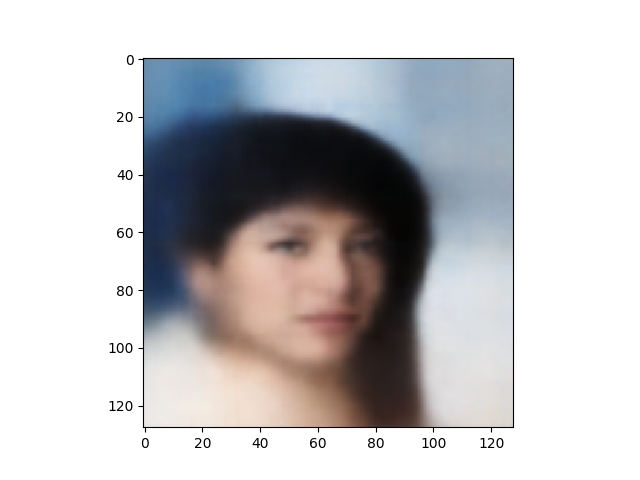
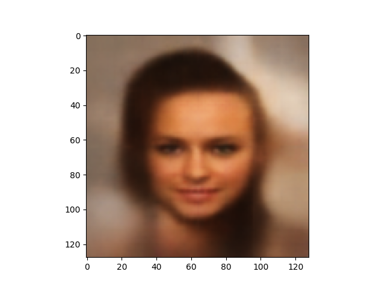
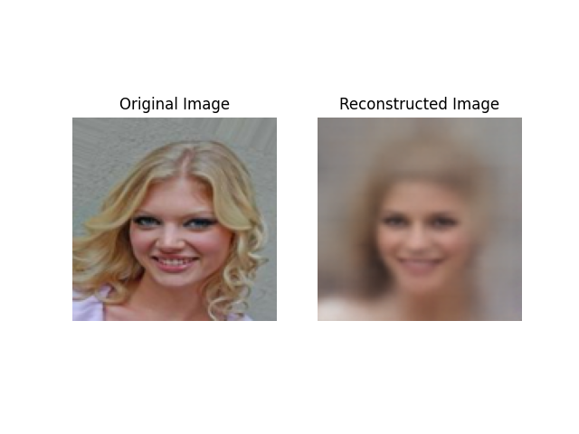
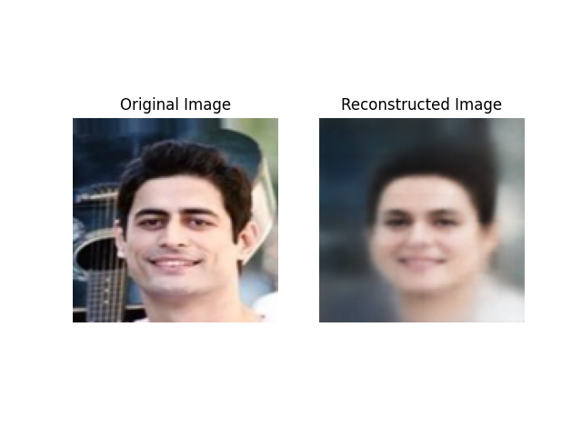

# CelebA VAE

This project contains a Variational Autoencoder (VAE) model trained on the CelebA dataset.

## Description

The CelebA VAE is a deep learning model that can generate realistic images of human faces. It is trained using the CelebA dataset, which consists of over 200,000 celebrity images. The VAE learns to encode the images into a lower-dimensional latent space and then decode them back into realistic faces.

## Features

- Image generation: The trained VAE can generate new images of human faces.
- Latent space interpolation: Explore the latent space by interpolating between different face representations.
- Face reconstruction: Given an input image, the VAE can reconstruct a similar face.

## Usage

To use the CelebA VAE, follow these steps:

1. Install the required dependencies listed in the `requirements.txt` file.
2. Download the CelebA dataset.
3. Train the VAE model using the preprocessed dataset. You can find the training script in the `train_script.py` file.
4. Once the model is trained, you can generate new images, interpolate in the latent space, or reconstruct faces using the `inference_script.py` file.
5. To use a pretrained model, run `inference_script.py` with the model path argument set to `saved_models/vae_20.pth`.

## Examples

Here are some examples of randomly generated images and reconstructed images:

### Randomly Generated Images

### Reconstructed Images

## Future Work

As evident from the images in the examples section, VAEs do not perform the best in terms of reconstruction since the features that are hard to learn end up becoming very blurry. This model learned facial features properly - namely eyes, nose, and mouth, but doesn't seem to learn features outside of the face such as hair, ears, or background. A follow-up to this project is to implement a VQ-VAE, which produce sharper images since model learns a discrete representation of the latent space rather than a continuous distribution.

## Contributing

Contributions to this project are welcome! If you find any issues or have suggestions for improvements, please open an issue or submit a pull request.
