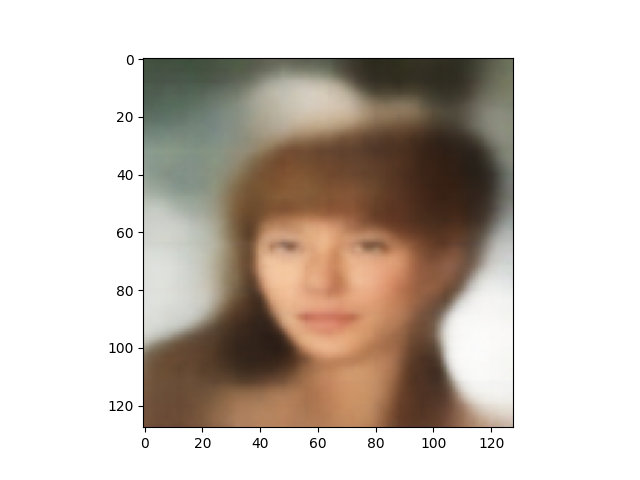
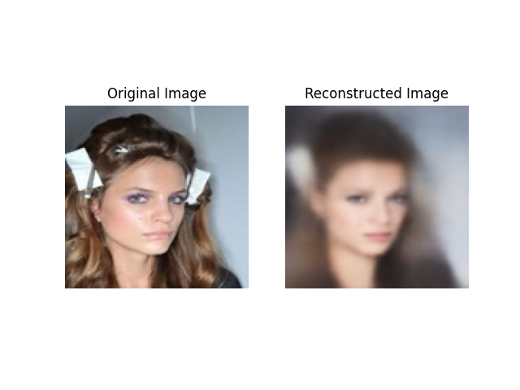

# CelebA VAE

This project contains a Variational Autoencoder (VAE) model trained on the CelebA dataset.

## Description

The CelebA VAE is a deep learning model that can generate realistic images of human faces. It is trained using the CelebA dataset, which consists of over 200,000 celebrity images. The VAE learns to encode the images into a lower-dimensional latent space and then decode them back into realistic faces.

## Features

- Image generation: The trained VAE can generate new images of human faces.
- Latent space interpolation: Explore the latent space by interpolating between different face representations.
- Face reconstruction: Given an input image, the VAE can reconstruct a similar face.

## Usage

To use the CelebA VAE, follow these steps:

1. Install the required dependencies listed in the `requirements.txt` file.
2. Download the CelebA dataset and preprocess it according to the instructions provided in the `data/README.md` file.
3. Train the VAE model using the preprocessed dataset. You can find the training script in the `train_script.py` file.
4. Once the model is trained, you can generate new images, interpolate in the latent space, or reconstruct faces using the `inference_script.py` file.

## Examples

Here are some examples of randomly generated images and reconstructed images:

### Randomly Generated Images

### Reconstructed Images

## Contributing

Contributions to this project are welcome! If you find any issues or have suggestions for improvements, please open an issue or submit a pull request.